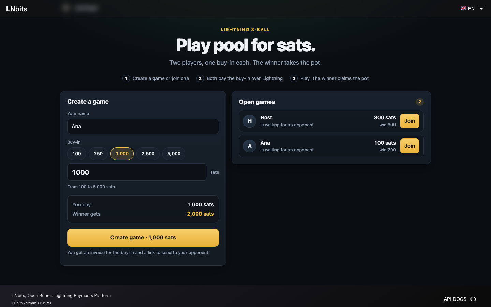
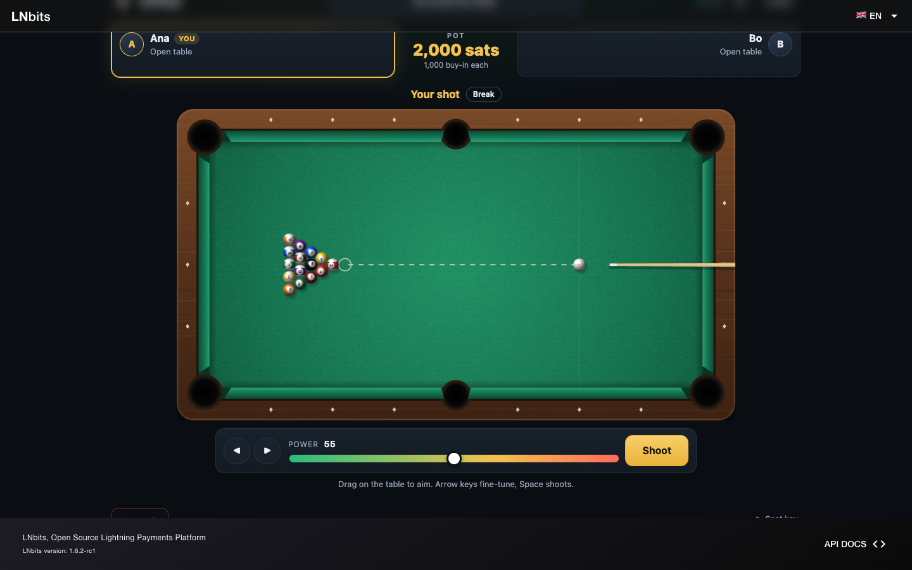

# LN Pool

1v1 8-ball pool for sats, as an LNbits WASM extension. A hall owner picks a
wallet and shares a link. A player creates a match and chooses the stake, an
opponent joins, both pay the same buy-in over Lightning, they play in the
browser, and the winner claims the pot to a Lightning address or an invoice.




- Extension id `lnpool`, type `wasm`, version 0.1.0
- Minimum LNbits: 1.6.1 (tested on 1.6.1 and 1.6.2)
- Owner page: `/ext/lnpool`
- Hall (public): `/ext/lnpool/halls/{hall_id}`
- Match (public): `/ext/lnpool/matches/{match_id}`

Design notes, with everything below in detail: [docs/DESIGN.md](docs/DESIGN.md).
Code and components from other projects: [THIRD_PARTY_NOTICES.md](THIRD_PARTY_NOTICES.md).

## Install

You need LNbits 1.6.1 or later and a funding source that can create and pay
invoices. Do not install it on 1.6.0: resolving a Lightning address there
would pay it.

- **From LNbits**, once LN Pool is listed in the extension catalog: open
  Extensions, find LN Pool, install it and enable it for your account.
- **By hand:** unpack a release into `wasm_extensions/lnpool` inside the
  LNbits data folder and restart LNbits. It loads every folder there at
  startup.

## Set up a hall

Open LN Pool from the LNbits menu.

1. Choose the wallet that will hold the buy-ins and pay the winners.
2. Set the smallest and largest stake, and the hall fee.
3. Tick "Open for new matches" and save.
4. Press "Authorize payouts" and approve the prompt. Winners are paid while
   you are away, so LNbits asks you to allow background payments from that
   wallet, up to twice the largest stake. Without it nobody can be paid
   automatically.
5. Copy the hall link and share it. Players need no LNbits account.

### Stakes and the fee

Both players pay the same stake. The pot is twice the stake. The hall fee is
a percentage of the pot that stays in your wallet; the winner gets the rest,
and sees that amount before paying. The prize is paid in full or not at all:
an invoice for any other amount is refused.

### Keep a float in the wallet

Lightning routing fees for a payout are paid from the hall wallet on top of
the prize. LNbits only sends a payment when the wallet holds the amount plus
a reserve for those fees: by default 2 sats, or 1% of the payment if that is
more.

So the wallet has to hold more than the pots. A hall fee of 1% or more leaves
enough once it comes to 2 sats. With a smaller fee, or small stakes, keep a
float. For example, at a stake of 5 sats and a 10% fee the pot is 10, the
prize is 9, and LNbits wants 11 in the wallet.

When the wallet is short, the payout is not sent. Nothing is lost: the player
is told the hall wallet needs funds, the owner page shows the match as "NOT
SENT", and the player claims again after you have topped up.

## A match

1. A player opens the hall link, enters a name, picks a stake and creates a
   match. They get an invoice and a link to send to their opponent.
2. The opponent opens the link and pays the same buy-in. The match starts
   only when LNbits has seen both payments.
3. Click or drag on the table to aim, use the arrow keys for fine aim, set
   the power, and shoot (or press Space). With ball in hand, drag the cue
   ball first. On a phone held upright the table is turned on its end.
4. The winner enters a Lightning address or an invoice for the exact prize.

A player's seat lives in their browser tab. The "Seat key" panel shows a key
that restores it in another tab or browser; anyone who has the key can play
and claim as that player.

The first player can cancel before anyone joins and claim the buy-in back.

### Rules

Seat 1 breaks. The table is open until the first legal pot after the break,
and the first ball down decides the groups. Pot your own to keep shooting.
Potting the cue ball, hitting nothing, or hitting the wrong ball first is a
foul and gives the other player ball in hand anywhere. The 8 wins once your
group is cleared, if you hit it first and do not foul; potted any other way it
loses. An 8 potted on the break is put back. No called pockets and no
rail-after-contact rule.

## Payouts, and when one does not go through

A pot is paid at most once. Lightning does not always answer in time, so a
payout can end in one of these states. The owner page shows every attempt and
what LNbits said.

| The player sees | What happened | What to do |
|---|---|---|
| Sent to your wallet | LNbits confirmed the payment. | Nothing. |
| Sending | The payment is in flight. | Wait. The page asks again by itself. |
| Nothing was sent | LNbits refused before sending: the wallet is short of the prize plus the reserve, a limit was hit, or payouts are not authorized. | Fix the cause. The player claims again, to the same wallet or another. |
| The payment did not go through | The Lightning node reported a failure, for example no route. | The player tries again. Once LNbits confirms the failure, they can name another wallet. |
| This payment could not be confirmed | A payment was started and LN Pool never heard how it ended. | See below. |

"Could not be confirmed" usually means the payment took longer than LNbits
allows one extension call (5 seconds by default). LNbits does not cancel the
payment, so the money has often arrived. LN Pool cannot look a payment up; it
can only ask LNbits to pay the same invoice again, which LNbits answers with
"already paid" without sending anything. LNbits only gets that far while the
wallet holds the prize plus the reserve.

- Look in the wallet's payments for an outgoing "LN Pool payout" with the
  match id. That list is the authority.
- To let LN Pool confirm it by itself, have the prize plus the reserve in
  the wallet and let the player press "Check the payment again".
- While a payment might exist, LN Pool never accepts another destination for
  that match. This is deliberate: it would rather leave a match for you to
  settle than pay twice.

After a payout that did not go through, the next claim has to come within
LNbits' invoice expiry (one hour by default) of the last one, and a match has
to be claimed within that time of being created. After that you settle it by
hand.

**Settling by hand.** Open the match on the owner page and press "Mark as
settled by hand" first; that stops any further claim. Then check the wallet's
payments, and pay or refund the player yourself only if there is no "LN Pool
payout" for that match, or it failed.

If payouts are often slow, raise LN Pool's "Max execution" runtime limit in
LNbits, for example to 15000 ms. LN Pool does not depend on it.

## Trust model and limits

Read this before putting real money on a table.

- **It is custodial.** The hall wallet holds the pot from the buy-ins until
  the claim. Players trust the hall owner with it, and with settling by hand
  when that is needed.
- **Agreement, not a referee.** A shot is sent as input (direction, power,
  cue-ball position). Both browsers simulate it with the same deterministic
  engine, and a turn counts only when both report the same table. The
  backend does not replay shots. This is not a perfect anti-cheat:
  - a player who is losing can stop reporting, and the match then stays open
    until the hall owner steps in;
  - a player can report a false table and force a dispute. They cannot win
    that way, but the match freezes. The owner page replays the disputed
    shot and says which report is wrong; acting on it is manual;
  - aim assistance cannot be detected;
  - two players acting together can agree on any result. They cannot be paid
    more than one pot.
- **Payouts fail closed.** If it is unclear whether a payment was made, the
  match stays bound to that invoice and waits for the hall owner. No second
  destination, no automatic retry to another wallet.
- **Late buy-ins need a refund by hand.** An invoice cannot be cancelled. A
  buy-in that arrives after the seat was taken is listed on the owner page.
- **Anyone who knows a match link can watch it**, and can send messages on its
  websocket channel. The page treats those as a hint to reload, never as game
  state or as a reason to pay.

Do not upgrade the extension while matches are in play.

## Development

```bash
cd dev
npm run check            # syntax checks and 82 unit tests
npm run build:wasm       # bundle, then jco componentize -> ../wasm/module.wasm
LNBITS_DIR=/path/to/lnbits e2e/run.sh   # 79 checks against LNbits itself
npm run check:release    # is the archive for this commit installable?
```

- `wasm/module.wasm` is committed because LNbits loads it as it is. Rebuild
  it after changing anything under `dev/src/`. Changes under `static/` or
  `ui/` need only a page reload; changes to `config.json` or `storage/` need
  an LNbits restart.
- The build pins jco 1.19.0 on purpose. Later versions produce a module that
  uses about ten times the WASM fuel and runs out of LNbits' default budget
  when a prize is claimed. The first build fetches jco with npx.
- `e2e/run.sh` needs an LNbits source checkout with its virtualenv in
  `.venv`. It starts LNbits on a throwaway data folder with the fake funding
  source, drives the extension through its real routes, measures the fuel of
  every call and fails if any uses more than half of the default limit.
- To try it by hand, link the repository into the data folder of a
  development LNbits (`ln -s "$PWD/.." /path/to/lnbits/data/wasm_extensions/lnpool`
  from `dev/`), start LNbits with `LNBITS_BACKEND_WALLET_CLASS=FakeWallet` for
  play money, and use `node scripts/bot.mjs <match link>` as an opponent.
- The release archive leaves out `dev/e2e` and the screenshots (see
  `.gitattributes`): LNbits refuses a WASM extension archive that contains
  Python files.
- `static/sponsors.js` fills the reserved sponsor places (a strip in the
  lobby, a strip under the table, a line on the cloth). It is empty by
  default and makes no network requests.
